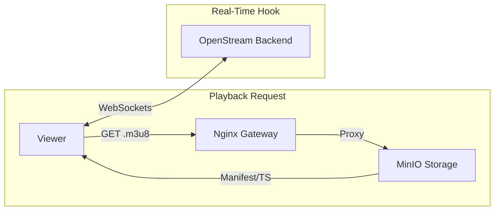

# OpenStream // PORTAL

**Status:** `OPERATIONAL` // **Tier:** `UI_SPOKE` // **Platform:** `OCTANEBREW_HUB`

**OpenStream** is a high-fidelity, real-time video delivery interface. It provides an immersive, "Noir-inspired" experience for consuming live broadcasts, engaging in persistent high-frequency chat, and managing VOD archives.

---

## Design Philosophy: The Noir Aesthetic

The portal adheres to the **Noir Minimalist Authority**:
*   **High-Contrast Interface**: Deep black backgrounds (`#050505`) with terminal-green highlights.
*   **Brutalist Visuals**: CRT scanline overlays and chromatic aberration effects on critical system notifications.
*   **Precision Layout**: Monospaced typography for technical data, ensuring an engineering-first UX.

---

## Directory Structure

```text
.
├── app/               # Next.js App Router (Layouts & Pages)
│   ├── (auth)/        # Authentication routes
│   ├── dashboard/     # Streamer command center
│   ├── watch/         # Video playback pages
│   └── globals.css    # Noir base styles
├── components/        # Reusable UI (VideoPlayer, Chat, etc.)
├── hooks/             # Custom React Hooks (useSocket, useAuth)
├── public/           # Static assets & OpenGraph images
└── tailwind.config.ts # Theme & Noir tokens
```

---

## Delivery & Playback Flow


---

## Core Features

*   **Sub-Second Latency Playback**: Integrated **Video.js** player optimized for low-latency HLS fragments.
*   **Fluidic Chat Engine**: Persistent, WebSocket-driven chat with real-time state synchronization across devices.
*   **Uplink Monitor**: A terminal-style command deck for real-time stream diagnostics and bitrate monitoring.
*   **Adaptive Theme Interpolation**: Leverages the shared platform design tokens for a consistent brand identity.

---

## Tech Stack

*   **Framework**: Next.js 16 (App Router)
*   **State Management**: React Context & Hooks for localized stream state.
*   **Real-time**: Socket.IO Client for duplex chat communication.
*   **Video**: Video.js with HLS enhancement.
*   **Styling**: Vanilla CSS with HSL variables for dynamic theme switching.

---

## Resilience & Deployment

### CI/CD Pipeline
This repository uses a **reusable platform-wide GitHub Actions workflow** located in the [octanebrew-platform](https://github.com/shubh305/octanebrew-platform).

*   **Workflow**: `.github/workflows/deploy.yml`
*   **Strategy**: Containerized deployments via Docker Compose over SSH.
*   **Verification**: Automated build checks before pushing to production.

### Local Development
```bash
# Install dependencies
npm install

# Start the development server
npm run dev
```

---

## 🔒 Security & Optimization

*   **Noir-Shield Integration**: All traffic is routed through the **OctaneBrew Nginx Gateway** with Cloudflare IP enforcement.
*   **HTTP/2 Performance**: Fully optimized for H2 multiplexing to handle high-frequency asset loading and socket management.
*   **Image Optimization**: Leverages Next.js `next/image` for high-fidelity thumbnails with minimal bandwidth impact.
