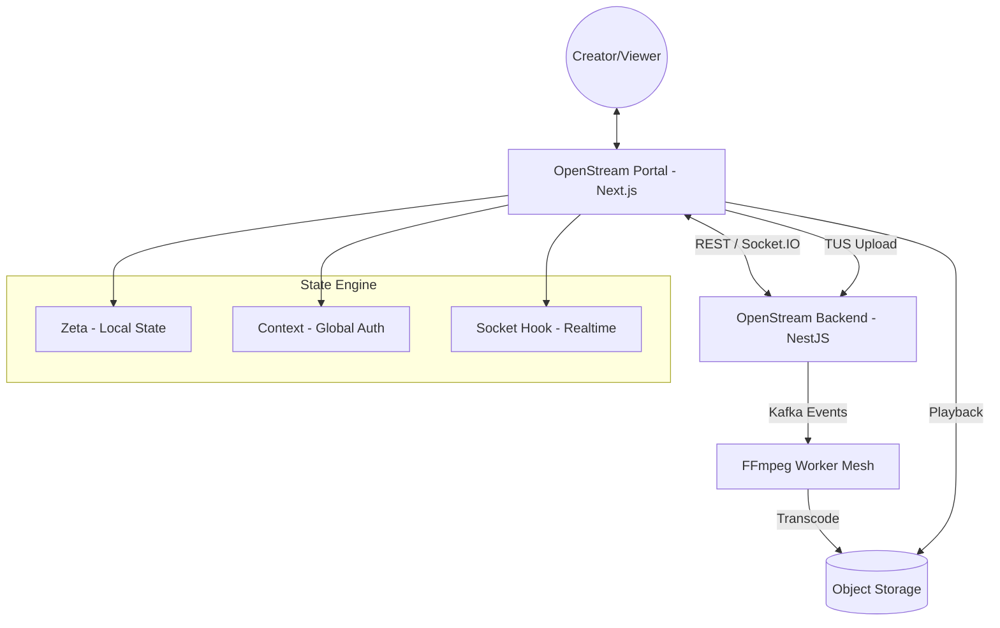

# Frontend Architecture — OpenStream

## 1. System Philosophy: The Noir Aesthetic
OpenStream's frontend is a specialized portal built on the **Noir** design system. Unlike traditional streaming platforms, it prioritizes a developer-centric, terminal-inspired interface (`#050505` backgrounds, monospaced typography) to reflect high-fidelity engineering and precision control.

---

## 2. Core Frontend Architecture

### 2.1 Component Interaction Model
The frontend acts as the real-time interface for video ingestion and consumption, orchestrating WebSocket events and heavy media uploads via specialized hooks.

### 2.2 Vertical Feature Slices
The codebase is structured around business domains rather than technical layers, ensuring that features like "Chat" or "Player" are self-contained.

- **Studio Slice**: Dashboard for creators to manage streams and VOD assets.
- **Watch Slice**: Immersive playback environment with integrated chat.
- **Auth Slice**: Sovereign authentication flows independent of the central hub.

---

## 3. High-Performance Front-end Strategy

| Capability | Implementation | Purpose |
| :--- | :--- | :--- |
| **Ingestion** | TUS Protocol (via `useChunkedUpload`) | Resumable, chunked uploads that survive network instability. |
| **Real-Time** | Socket.IO (via `useVideoStatus`) | Sub-second updates on VOD processing states (Processing -> Playable). |
| **Playback** | Video.js HLS | Adaptive bitrate switching based on network conditions and "Fast/Slow Lane" availability. |
| **State** | Hybrid (Zeta + Context) | High-frequency local state for UI interactions; Global context for auth. |

---

## 4. Complex Feature Subsystems

### 4.1 Smart Upload Wizard
A client-side orchestration engine that performs **Magic Byte Validation** before any data leaves the browser. It manages the TUS upload lifecycle, providing granular progress feedback and auto-retries.

### 4.2 Live Chat Engine
A persistent WebSocket component designed for high-frequency message throughput. It handles optimistic updates to the UI while ensuring eventual consistency with the backend message store.

### 4.3 Noir Design System
A strict implementation of the "Industrial Dark Mode" aesthetic. It enforces high contrast ratios and terminal-green highlights via Tailwind CSS 4 variables, ensuring a cohesive visual identity across the portal.

### 4.4 Intelligent Playback Subsystem
The Watch Slice includes AI-driven enhancements:
- **Seekbar Smart Thumbnails**: Utilizes the `useSpritePreview` hook to fetch dynamically generated VTT files maps, updating CSS `background-position` on hover to show exact frame previews without loading thousands of images.
- **Highlight Strip**: Renders interactive "chapters" on the progress bar derived from the `aiMetadata.keyMoments` schema.
- **Transcriptions**: Integrates a `SubtitleSelector` that dynamically loads Whisper-generated WebVTT files based on the video's compliance flags.

### 4.5 AI Semantic Search
The Search experience integrates a toggle-able AI mode. This feature allows users to query conceptually rather than literally (e.g., "fastest lap" vs "lap 3"). 
- Incorporates a **Recent Searches** client-side memory utilizing `localStorage` to improve UX persistence across sessions.
