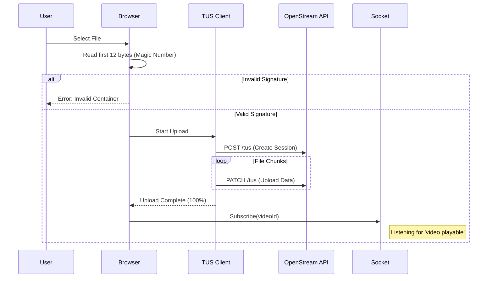

# User Workflows

## 1. The Smart Upload Journey

The upload process is designed to be resilient and informative.

### Interaction Sequence

1.  **File Selection**:
    *   User drops a file.
    *   **Magic Byte Validator**: Checks the first 12 bytes of the file in the browser (client-side) to ensure it's a valid video container. Prevents wasting bandwidth on invalid files.

2.  **Upload Phase**:
    *   **TUS Client**: Starts a resumable upload session.
    *   **Progress UI**: Shows a real-time progress bar. Note: If the user closes the tab, they can resume later (if the session persists).

3.  **Processing Phase**:
    *   Once upload completes (100%), the UI switches to "Processing" state.
    *   It subscribes to `useVideoStatus(videoId)`.
    *   **Stage 1 - Playable**: When the 480p rendition is ready, the UI updates to show "Ready to Watch".
    *   **Stage 2 - Complete**: When 1080p is ready, the quality badge updates to "HD".

---

## 2. Playback Experience

The `VideoPlayer` component is state-aware.

*   **Initialization**: Checks if `hlsManifest` exists.
*   **Auto-Play**: Muted autoplay by default.
*   **Quality Switching**:
    *   Uses `video.js` HTTP Live Streaming (HLS) tech.
    *   Automatically adapts to bandwidth.
    *   If the user selects a higher quality source (e.g., 1080p) that isn't ready yet, it falls back gracefully or shows a "Processing" overlay.

---

## 3. Real-Time Chat

The chat component is a "dumb" view layer powered by a smart hook.

1.  **Connection**: `useChat(channelId)` connects to the WebSocket.
2.  **Optimistic Updates**: When a user sends a message, it is immediately added to the local list (greyed out) until the server acknowledges it (turns solid).
3.  **Visuals**:
    *   **Avatars**: User avatars are pulled from the `conduit-core` profile service.
    *   **System Messages**: Special styling for events like "User Subscribed".
