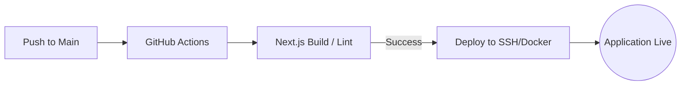

# Infrastructure & Operations (Frontend) — OpenStream

## 1. Frontend Build & Deployment Pipeline

OpenStream Frontend utilizes a standardized Next.js build pipeline optimized for Docker containerization within the OctaneBrew cluster.

---

## 2. Infrastructure Stack

| Component | Technology | Role |
| :--- | :--- | :--- |
| **Framework** | Next.js 16 (App Router) | React framework and Server Components. |
| **Styling Engine** | Tailwind CSS v4 | Build-time CSS optimization (Noir Theme). |
| **Real-Time** | Socket.IO Client | Persistent connection for Chat/Status. |
| **Video Player** | Video.js | HLS playback engine. |
| **Reverse Proxy** | Nginx Gateway | SSL termination and asset routing. |

---

## 3. High-Scale Deployment Strategy

### 3.1 Edge-Cached Delivery
Static assets (thumbnails, JS bundles, CSS) are served via Nginx with aggressive caching policies, while dynamic content (stream status, chat) bypasses the cache via WebSockets.

### 3.2 Dynamic Route Splitting
The application uses Next.js Route Groups to segment the **Studio** (heavy dashboard) from the **Watch** (lighter playback) experience.
- **Benefit**: Viewers download a significantly smaller JS bundle than creators, improving Time-to-Interactive (TTI) for the majority of traffic.

---

## 4. Monitoring & Performance
- **Bundle Analysis**: Automated checks for `video.js` and `ffmpeg.wasm` to ensure they are lazy-loaded.
- **Socket Health**: Client-side tracking of WebSocket connection stability and reconnection attempts.
